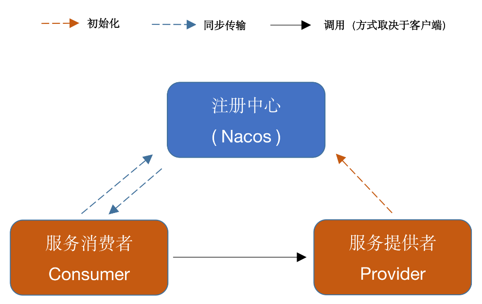

# RPCFramework

RPCFramework 是一款基于 Nacos 实现的 RPC 框架。网络传输实现了基于 Java 原生 Socket 与 Netty 版本，并且实现了多种序列化与负载均衡算法。

## 组织架构

```
RPCFramework
├── rpc-api -- 通用接口
├── rpc-common -- 工具类及实体对象
├── rpc-core -- rpc核心包
├── test-client -- 客户端（消费者）
├── test-server -- 服务端（生产者）
```

## 架构图



消费者调用提供者的方式取决于消费者的客户端选择，如选用原生 Socket 则该步调用使用 BIO，如选用 Netty 方式则该步调用使用 NIO。如该调用有返回值，则提供者向消费者发送返回值的方式同理。

## 特性

- 实现了基于 Java 原生 Socket 传输与 Netty 传输两种网络传输方式
- 实现了四种序列化算法，Json 方式、Kryo 算法、Hessian 算法与 Google Protobuf 方式（默认采用 Kryo方式序列化）
- 实现了两种负载均衡算法：随机算法与轮转算法
- 使用 Nacos 作为注册中心，管理服务提供者信息
- 消费端如采用 Netty 方式，会复用 Channel 避免多次连接
- 如消费端和提供者都采用 Netty 方式，会采用 Netty 的心跳机制，保证连接
- 接口抽象良好，模块耦合度低，网络传输、序列化器、负载均衡算法可配置
- 实现自定义的通信协议
- 服务提供侧自动注册服务

## 传输协议

调用参数与返回值的传输采用了自己定义的传输协议如下以防止粘包：

```
+---------------+---------------+-----------------+-------------+
|  Magic Number |  Package Type | Serializer Type | Data Length |
|    4 bytes    |    4 bytes    |     4 bytes     |   4 bytes   |
+---------------+---------------+-----------------+-------------+
|                          Data Bytes                           |
|                   Length: ${Data Length}                      |
+---------------------------------------------------------------+
```

| 字段            | 解释                                                         |
| :-------------- | :----------------------------------------------------------- |
| Magic Number    | 魔数，表识一个 MRF 协议包，0xCAFEBABE                        |
| Package Type    | 包类型，标明这是一个调用请求还是调用响应                     |
| Serializer Type | 序列化器类型，标明这个包的数据的序列化方式                   |
| Data Length     | 数据字节的长度                                               |
| Data Bytes      | 传输的对象，通常是一个`RpcRequest`或`RpcClient`对象，取决于`Package Type`字段，对象的序列化方式取决于`Serializer Type`字段。 |

### 搭建步骤

下载Nacos，并且运行在8848端口

首先启动服务提供者，再启动消费者。

## LICENSE

This repository is released under the Apache 2.0 license as found in the [LICENSE](https://github.com/czczup/URST/blob/main/LICENSE.md) file.
